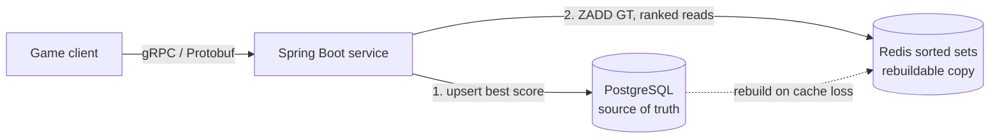

# leaderboard-service

A small player-stats and leaderboard backend: games submit scores over gRPC, and the service
answers "who's on top", "where am I", and "how do I compare to my friends".

Java 25 · Spring Boot 4 · gRPC / Protocol Buffers · PostgreSQL · Redis · Docker · Azure Container Apps



## API

Defined in [`leaderboard.proto`](src/main/proto/leaderboard.proto).

| Call | What it does |
|---|---|
| `SubmitScore` | Keeps the player's best score and returns their current rank |
| `GetTop` | Top N players, highest first |
| `GetAroundPlayer` | The player plus `radius` neighbours above and below |
| `GetFriends` | Ranks only the player ids the caller passes in |

## Live demo

The service runs on Azure Container Apps in Canada Central. It scales to zero when idle, so the
first call after a quiet spell takes about 20 seconds while a replica starts; after that, calls
return in well under a second.

```bash
grpcurl -d '{"leaderboard_id":"demo","limit":10}' \
  leaderboard.gentlesand-2647a396.canadacentral.azurecontainerapps.io:443 \
  leaderboard.v1.Leaderboard/GetTop
```

## Run it locally

```bash
docker compose up --build
```

gRPC listens on `localhost:9090` with server reflection on, so `grpcurl` needs no proto file:

```bash
grpcurl -plaintext -d '{"leaderboard_id":"demo","player_id":"ana","score":4200}' \
  localhost:9090 leaderboard.v1.Leaderboard/SubmitScore

grpcurl -plaintext -d '{"leaderboard_id":"demo","limit":10}' \
  localhost:9090 leaderboard.v1.Leaderboard/GetTop
```

## Design decisions

**Postgres is the source of truth; Redis is a copy that can be thrown away.** A submit commits to
Postgres first, then updates a Redis sorted set, which answers every ranked read in O(log N).
Losing Redis loses no data.

**Submits are idempotent.** Postgres keeps `GREATEST(old, new)` and Redis uses `ZADD GT`, so
retries and out-of-order writes for the same player always converge on the best score.

**Never write to a leaderboard that isn't cached.** After Redis loses a leaderboard, a plain
`ZADD` would create a sorted set holding only the player who just submitted. It would look cached
and be wrong until the next restart. A short Lua script checks `EXISTS` and adds atomically; on a
miss the service rebuilds the leaderboard from Postgres first.

**Rebuilds happen once and appear all at once.** Only one request rebuilds while the others
wait, and the whole leaderboard is loaded in a single atomic `ZADD`, so readers never see a
half-loaded ranking.

**The friends list belongs to the caller.** `GetFriends` takes player ids and ranks them with one
`ZMSCORE`. A social graph is another service's job.

**Requests are validated at the edge.** Ids are restricted to a safe character set, page sizes
are capped, and scores are limited to ±2^53 because Redis stores scores as doubles.

## The bug the load test found

The first cold-cache run showed every concurrent request rebuilding the same leaderboard at
once: a cache stampede. Fixed with the single rebuild described above, and pinned by a test that
fails without the lock (16 rebuilds instead of 1).

Cold cache, 100,000 players, 64 concurrent clients, first 10 seconds after Redis is wiped:

| | Before | After |
|---|---|---|
| Rebuilds from Postgres | 64 | 1 |
| Time per rebuild | 3.4 s | 0.2 s |
| Slowest request | 3.77 s | 0.63 s |
| Throughput | 4,717 req/s | 8,391 req/s |
| App memory | 801 MiB | 480 MiB |

## Load test

One leaderboard of 100,000 players; 40% `SubmitScore`, 40% `GetTop(10)`, 20%
`GetAroundPlayer(radius 5)`; 30 seconds per run with a warm cache.

| Concurrent clients | Requests/s | p95 | p99 |
|---|---|---|---|
| 16 | 8,962 | 2.8 ms | 4.7 ms |
| 32 | 11,262 | 4.7 ms | 6.6 ms |
| 64 | 12,428 | 9.4 ms | 13.5 ms |
| 128 | 12,776 | 20.6 ms | 32.4 ms |

Zero failed requests across 1.36 million. Everything ran on one Apple M1 laptop (8 GB RAM): the
service, Postgres, Redis, and the k6 load generator shared Docker Desktop's 8-CPU, 4 GB VM, so
these are floor numbers, not what dedicated hardware would give.

Reproduce:

```bash
docker compose up --build -d
docker compose exec -T postgres psql -U leaderboard -q -f - < loadtest/seed.sql
docker run --rm -i --network leaderboard-service_default -e TARGET=app:9090 -e VUS=32 \
  grafana/k6 run - < loadtest/k6.js
```

## Tests

```bash
./mvnw verify   # needs Docker running
```

Five integration tests make real gRPC calls against real Postgres and Redis containers
(Testcontainers). Two of them wipe or bypass Redis to prove the rebuild path. The same command
runs in GitHub Actions on every push.

To run the service locally without Compose: `./mvnw spring-boot:test-run`.

## Deployment

[`deploy.sh`](deploy.sh) deploys the image that CI publishes to Azure Container Apps.

- **The service and Redis run as two containers in one replica.** Redis is a sidecar on
  `localhost`, so it scales to zero with the app and comes back empty.
- **Postgres is a managed database on Neon**, so scores outlive every replica.
- **Every cold start exercises the rebuild path.** The first request after a scale-up finds Redis
  empty and reloads the leaderboard from Postgres. From the production log after a restart:
  `Rebuilt leaderboard demo from Postgres: 3 players in 200 ms`.
- **Ingress is HTTP/2 end to end**, which gRPC needs, and Azure terminates TLS. This rules out
  Azure's "express" environments, which support neither HTTP/2 ingress nor sidecars.

## Known limits

- **Ties** are ordered by player id, not by who reached the score first.
- **The rebuild lock is per instance.** N replicas may each rebuild a cold leaderboard once. A
  Redis lock would make it once overall.
- **A rebuild loads the leaderboard in one command**, which tops out near 500,000 players. Larger
  boards need a chunked load into a temporary key, then a rename.
- **If the Redis update fails after the Postgres commit**, that player's cached score is stale
  until they submit again or the leaderboard is rebuilt. The client gets an error and can retry
  safely.
- No authentication, and a single Redis node. The hosted demo is open to anyone and capped at
  one small replica.
